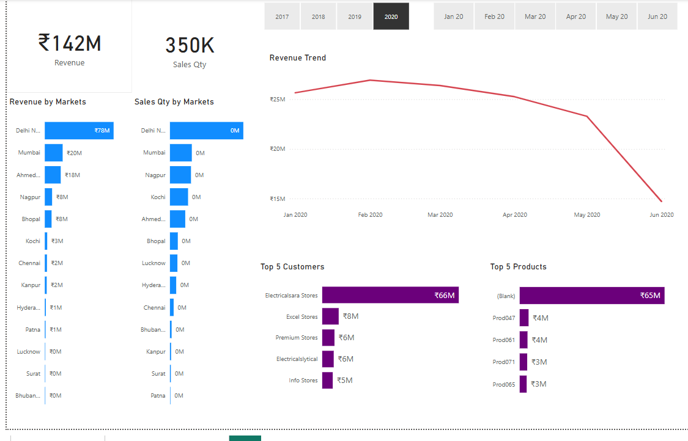

# Task_4
Interactive dashboard for business stakeholders

# Sales_insights
# 📊 Sales Insight Dashboard

A professional and interactive Power BI dashboard built to visualize and analyze sales data, providing key insights into revenue, profit, product performance, and customer behavior.

## 🗂️ Project Overview

This project presents a **Sales Insight Dashboard** developed using **Power BI**. The dashboard helps stakeholders understand sales performance across various metrics and dimensions. It can be used by business analysts, sales managers, or decision-makers to identify trends, monitor KPIs, and make data-driven decisions.

## 📌 Key Features

- 📈 Visual representation of **Revenue**, **Profit**, and **Quantity Sold**
- 🌍 Sales performance by **Country/Region**
- 🛍️ Product category and sub-category analysis
- 👤 Customer segmentation and purchase patterns
- 📆 Time-based filters for monthly/quarterly/yearly analysis
- ✅ Interactive slicers and filters for deep drill-down

## 🧰 Tools & Technologies

- **Power BI Desktop**
- **DAX (Data Analysis Expressions)**
- **Data Modeling**
- **ETL (Extract, Transform, Load)** processes within Power BI

## 📁 File

- `sales_insight_dashboard.pbix` — The Power BI report file.

## 🚀 How to Use

1. Download and install [Power BI Desktop](https://powerbi.microsoft.com/desktop/).
2. Clone or download this repository.
3. Open the `.pbix` file in Power BI Desktop.
4. Explore the dashboard using filters, slicers, and charts.

## 📝 Insights Derived

- Identification of best-performing regions and products
- Revenue trends over time
- Profit margins across categories
- Key areas for business improvement and optimization

## 📷 Dashboard Preview

